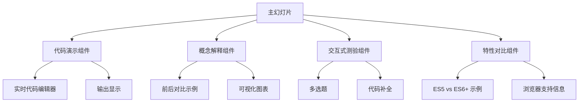
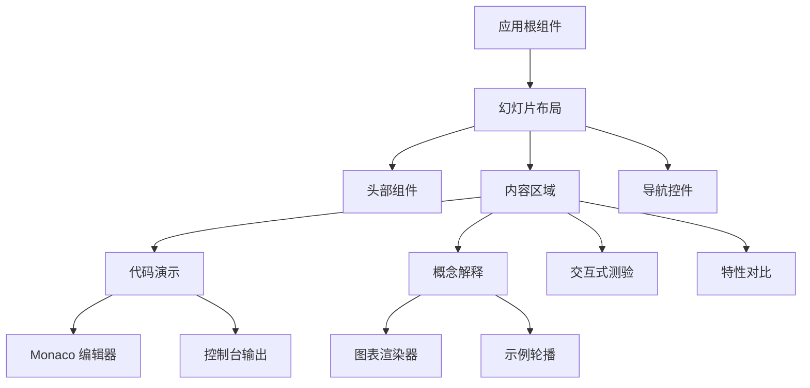
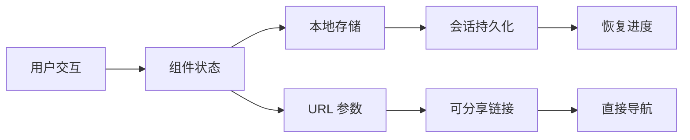
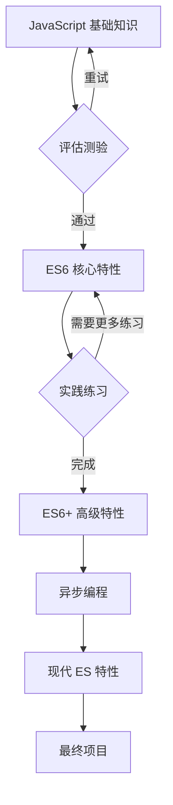

# JavaScript 与 ES 基础知识学习幻灯片设计

## 概述

### 项目目标
使用 Slidev 设计和开发一个交互式教育幻灯片，用于教授 JavaScript 基础知识和 ECMAScript (ES6-ES11) 特性。该演示文稿将作为开发者的综合学习资源，通过交互式示例和实时代码演示来理解核心 JavaScript 概念和现代 ES 特性。

### 目标用户
- 初级到中级 JavaScript 开发者
- 从其他语言转向 JavaScript 的开发者
- 学习现代 JavaScript 开发的学生
- 寻求理解 ES6+ 特性的开发者

### 学习目标
- 掌握 JavaScript 基础（变量、函数、对象、数组）
- 理解 ES6+ 特性（箭头函数、解构、模块、类）
- 学习异步编程概念（Promise、async/await）
- 探索现代 JavaScript 模式和最佳实践

## 技术栈与依赖

### 核心框架
- **Slidev v52.1.0**: 基于 Vue.js 的演示框架
- **Vue 3.5.18**: 用于交互元素的组件框架
- **TypeScript**: 类型安全的开发环境

### 现有基础设施
- **主题**: Seriph 主题，专业的演示样式
- **构建系统**: ES 模块与现代 JavaScript 支持
- **开发工具**: 热重载开发服务器
- **导出选项**: PDF、静态站点和演示模式

### 开发环境
```bash
# 开发服务器
pnpm dev

# 生产构建
pnpm build

# 导出静态幻灯片
pnpm export
```

## 组件架构

### 交互式学习组件



#### 组件定义

**CodeDemo.vue（代码演示组件）**
- 属性: `{ code: string, language: string, editable: boolean, showOutput: boolean }`
- 状态: 当前代码内容、执行结果
- 功能: 语法高亮、实时编辑、结果显示

**ConceptExplainer.vue（概念解释组件）** 
- 属性: `{ concept: string, examples: Array, visualType: string }`
- 功能: 逐步概念分解、视觉辅助

**InteractiveQuiz.vue（交互式测验组件）**
- 属性: `{ questions: Array, type: 'multiple-choice' | 'code-complete' }`
- 状态: 当前问题、用户答案、分数跟踪

**FeatureComparison.vue（特性对比组件）**
- 属性: `{ oldWay: string, newWay: string, feature: string }`
- 功能: 并排代码对比、突出改进

### 组件层次结构



## 幻灯片内容结构

### 模块 1：JavaScript 基础知识
#### 幻灯片章节：
- **变量与数据类型**
  - var、let、const 声明
  - 原始类型 vs 引用类型
  - 类型强制转换示例
  
- **函数**
  - 函数声明 vs 函数表达式
  - 变量提升行为
  - 作用域和闭包
  
- **对象与数组**
  - 对象字面量语法
  - 数组方法和迭代
  - 属性访问模式

#### 交互元素：
- 实时变量声明示例
- 函数作用域可视化
- 对象操作练习

###  对象与对象的原型
- 什么是对象
- JavaScript 创建对象有哪些方法
- 什么是对象的原型
- 对象原型和原型链

### 模块 2：ES6 核心特性
#### 幻灯片章节：
- **箭头函数**
  - 语法对比（function vs =>）
  - `this` 绑定差异
  - 使用场景和限制
  
- **解构赋值**
  - 数组解构模式
  - 对象解构与重命名
  - 嵌套解构示例
  
- **模板字符串**
  - 字符串插值
  - 多行字符串
  - 标签模板

#### 交互元素：
- 前后代码转换
- 逐步解构分解
- 模板字符串操作场

### 模块 3：ES6+ 高级特性
#### 幻灯片章节：
- **类与继承**
  - 类语法 vs 原型
  - 构造函数模式
  - extends 继承
  
- **模块**
  - import/export 语法
  - 默认导出 vs 命名导出
  - 动态导入
  
- **Symbol 与迭代器**
  - Symbol 原始类型
  - 自定义迭代器
  - 生成器函数

#### 交互元素：
- 类转换示例
- 模块导入/导出模拟器
- 迭代器模式演示

### 模块 4：异步编程 (ES2015-ES2020)
#### 幻灯片章节：
- **Promise**
  - Promise 状态和生命周期
  - 链式操作（.then、.catch）
  - Promise.all、Promise.race
  
- **Async/Await (ES2017)**
  - 语法和错误处理
  - Promise 转 async/await
  - 并行 vs 顺序执行
  
- **高级异步模式**
  - 异步迭代器 (ES2018)
  - Promise.allSettled (ES2020)
  - 顶层 await (ES2022)

#### 交互元素：
- Promise 状态可视化器
- 异步执行时间线
- 错误处理对比

### 模块 5：现代 ES 特性 (ES2019-ES2022)
#### 幻灯片章节：
- **ES2019 特性**
  - Array.flat() 和 flatMap()
  - Object.fromEntries()
  - 可选 catch 绑定
  
- **ES2020 特性**
  - 可选链式调用 (?.)
  - 空值合并 (??)
  - BigInt 类型
  
- **ES2021-ES2022 特性**
  - 逻辑赋值运算符
  - 私有类方法
  - 顶层 await

#### 交互元素：
- 特性可用性检查器
- 浏览器兼容性矩阵
- 渐进增强示例

## 样式策略

### 设计系统
- **色彩方案**: 与 Seriph 主题保持一致
  - 主色: #2B90B6 (蓝色渐变)
  - 辅助色: #4EC5D4 (浅蓝色)
  - 强调色: #146b8c (深蓝色)
  - 语法高亮: VS Code 暗色主题

- **字体层级**:
  - 标题: 主标题渐变文字效果
  - 代码: Monaco 编辑器字体系列
  - 正文: 清晰的无衣线字体，提高可读性

- **布局模式**:
  - 双列布局用于对比
  - 全宽布局用于代码演示
  - 卡片式布局用于概念解释

### 组件样式
```css
/* 代码块样式 */
.code-demo {
  border-radius: 8px;
  background: var(--slidev-code-background);
  overflow: hidden;
}

/* 交互元素 */
.interactive-quiz {
  padding: 2rem;
  border: 2px solid var(--slidev-theme-primary);
  border-radius: 12px;
}

/* 特性对比 */
.comparison-container {
  display: grid;
  grid-template-columns: 1fr 1fr;
  gap: 2rem;
}
```

## 状态管理

### 幻灯片进度跟踪
- 当前模块和幻灯片位置
- 已完成练习和测验分数  
- 用户偏好（主题、字体大小）

### 交互状态
- 代码编辑器内容和执行结果
- 测验答案和进度
- 书签和收藏幻灯片

### 数据流模式


## API 集成层

### 外部资源
- **MDN 文档链接**: 上下文相关的官方文档引用
- **浏览器兼容性数据**: 实时兼容性信息
- **代码执行**: 客户端 JavaScript 执行实时示例

### 内容管理
- **代码片段库**: 存储在 `/snippets` 中的可重用代码示例
- **资源管理**: 图像、图表和多媒体内容
- **版本控制**: 基于 Git 的内容版本管理

## 测试策略

### 组件测试
```javascript
// CodeDemo 组件测试示例
describe('CodeDemo 组件', () => {
  test('应该执行 JavaScript 代码并显示输出', () => {
    const wrapper = mount(CodeDemo, {
      props: { code: 'console.log("你好世界")', editable: true }
    });
    
    expect(wrapper.find('.code-editor')).toBeTruthy();
    expect(wrapper.find('.output-display')).toBeTruthy();
  });
});
```

### 内容验证
- Markdown 语法验证
- 代码片段执行测试
- 跨浏览器兼容性测试
- 无障碍合规性 (WCAG 2.1)

### 性能测试
- 幻灯片加载性能
- 交互组件响应性
- 内存使用优化
- 打包大小分析

## 导航与用户体验

### 幻灯片导航模式
- **线性导航**: 顺序学习路径
- **模块式导航**: 在主要章节间跳转  
- **搜索功能**: 查找特定概念或代码示例
- **书签系统**: 保存重要幻灯片以便复习

### 交互功能
- **进度指示器**: 模块进度的视觉显示
- **笔记功能**: 幻灯片上的持久化用户笔记
- **代码操作场**: 实验性编码环境
- **测验系统**: 知识验证检查点

### 响应式设计
- **桌面端**: 带有分列布局的全功能体验
- **平板端**: 优化的触摸交互
- **移动端**: 简化导航和触摸友好控件

## 内容组织策略

### 文件结构
```
slides.md                 # 主演示文稿入口
├── pages/
│   ├── 01-fundamentals.md
│   ├── 02-es6-core.md  
│   ├── 03-es6-advanced.md
│   ├── 04-async.md
│   └── 05-modern-es.md
├── components/
│   ├── CodeDemo.vue
│   ├── ConceptExplainer.vue
│   ├── InteractiveQuiz.vue
│   └── FeatureComparison.vue
└── snippets/
    ├── fundamentals/
    ├── es6-examples/
    ├── async-patterns/
    └── modern-features/
```

### 学习路径设计


### 内容交付策略
- **渐进式揭示**: 逐步显示概念
- **间隔重复**: 在模块间强化关键概念
- **实际应用**: 真实世界的示例和用例
- **视觉学习**: 图表和交互式演示