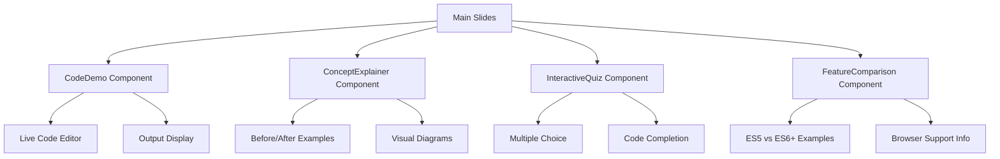
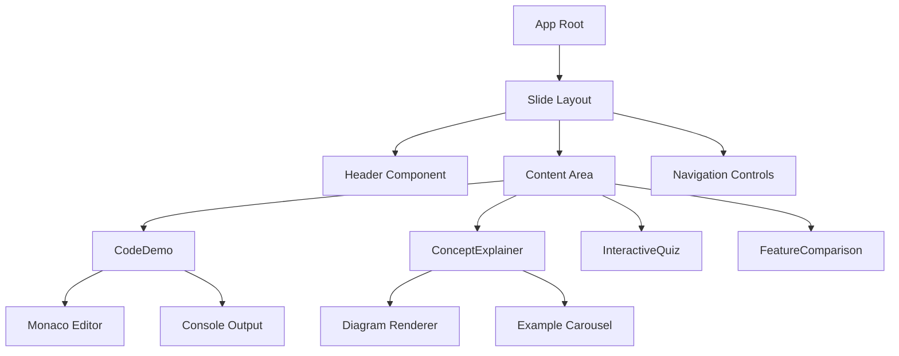
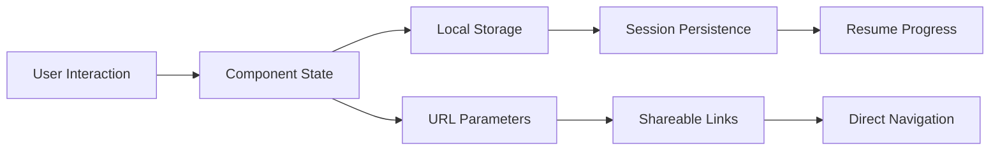
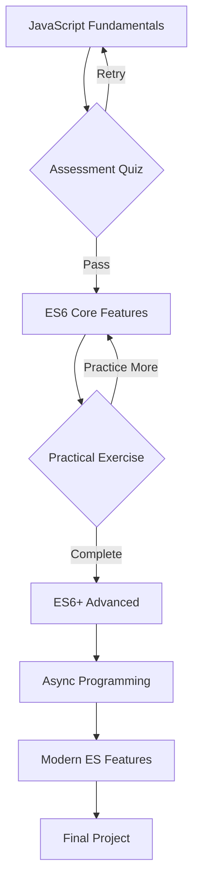

# JavaScript & ES Basics Learning Slideshow Design

## Overview

### Project Purpose
Design and develop an interactive educational slideshow using Slidev to teach JavaScript fundamentals and ECMAScript (ES6-ES11) features. The presentation will serve as a comprehensive learning resource for developers to understand core JavaScript concepts and modern ES features through interactive examples and live code demonstrations.

### Target Audience
- Beginner to intermediate JavaScript developers
- Developers transitioning from other languages to JavaScript
- Students learning modern JavaScript development
- Developers seeking to understand ES6+ features

### Learning Objectives
- Master JavaScript fundamentals (variables, functions, objects, arrays)
- Understand ES6+ features (arrow functions, destructuring, modules, classes)
- Learn async programming concepts (Promises, async/await)
- Explore modern JavaScript patterns and best practices

## Technology Stack & Dependencies

### Core Framework
- **Slidev v52.1.0**: Vue.js-based presentation framework
- **Vue 3.5.18**: Component framework for interactive elements
- **TypeScript**: Type-safe development environment

### Existing Infrastructure
- **Theme**: Seriph theme for professional presentation styling
- **Build System**: ES Modules with modern JavaScript support
- **Development Tools**: Hot-reload development server
- **Export Options**: PDF, static site, and presentation modes

### Development Environment
```bash
# Development server
pnpm dev

# Build for production
pnpm build

# Export static slides
pnpm export
```

## Component Architecture

### Interactive Learning Components



#### Component Definitions

**CodeDemo.vue**
- Props: `{ code: string, language: string, editable: boolean, showOutput: boolean }`
- State: Current code content, execution results
- Features: Syntax highlighting, live editing, result display

**ConceptExplainer.vue** 
- Props: `{ concept: string, examples: Array, visualType: string }`
- Features: Step-by-step concept breakdown, visual aids

**InteractiveQuiz.vue**
- Props: `{ questions: Array, type: 'multiple-choice' | 'code-complete' }`
- State: Current question, user answers, score tracking

**FeatureComparison.vue**
- Props: `{ oldWay: string, newWay: string, feature: string }`
- Features: Side-by-side code comparison, highlighting improvements

### Component Hierarchy



## Slide Content Structure

### Module 1: JavaScript Fundamentals
#### Slide Sections:
- **Variables & Data Types**
  - var, let, const declarations
  - Primitive vs reference types
  - Type coercion examples
  
- **Functions**
  - Function declarations vs expressions
  - Hoisting behavior
  - Scope and closures
  
- **Objects & Arrays**
  - Object literal syntax
  - Array methods and iteration
  - Property access patterns

#### Interactive Elements:
- Live variable declaration examples
- Function scope visualization
- Object manipulation exercises

### Module 2: ES6 Core Features
#### Slide Sections:
- **Arrow Functions**
  - Syntax comparison (function vs =>)
  - `this` binding differences
  - Use cases and limitations
  
- **Destructuring**
  - Array destructuring patterns
  - Object destructuring with renaming
  - Nested destructuring examples
  
- **Template Literals**
  - String interpolation
  - Multi-line strings
  - Tagged templates

#### Interactive Elements:
- Before/after code transformations
- Step-by-step destructuring breakdown
- Template literal playground

### Module 3: ES6+ Advanced Features
#### Slide Sections:
- **Classes & Inheritance**
  - Class syntax vs prototype
  - Constructor patterns
  - Inheritance with extends
  
- **Modules**
  - Import/export syntax
  - Default vs named exports
  - Dynamic imports
  
- **Symbols & Iterators**
  - Symbol primitive type
  - Custom iterators
  - Generator functions

#### Interactive Elements:
- Class transformation examples
- Module import/export simulator
- Iterator pattern demonstrations

### Module 4: Async Programming (ES2015-ES2020)
#### Slide Sections:
- **Promises**
  - Promise states and lifecycle
  - Chain operations (.then, .catch)
  - Promise.all, Promise.race
  
- **Async/Await (ES2017)**
  - Syntax and error handling
  - Converting promises to async/await
  - Parallel vs sequential execution
  
- **Advanced Async Patterns**
  - Async iterators (ES2018)
  - Promise.allSettled (ES2020)
  - Top-level await (ES2022)

#### Interactive Elements:
- Promise state visualizer
- Async execution timeline
- Error handling comparisons

### Module 5: Modern ES Features (ES2019-ES2022)
#### Slide Sections:
- **ES2019 Features**
  - Array.flat() and flatMap()
  - Object.fromEntries()
  - Optional catch binding
  
- **ES2020 Features**
  - Optional chaining (?.)
  - Nullish coalescing (??)
  - BigInt type
  
- **ES2021-ES2022 Features**
  - Logical assignment operators
  - Private class methods
  - Top-level await

#### Interactive Elements:
- Feature availability checker
- Browser compatibility matrix
- Progressive enhancement examples

## Styling Strategy

### Design System
- **Color Palette**: Consistent with Seriph theme
  - Primary: #2B90B6 (Blue gradient)
  - Secondary: #4EC5D4 (Light blue)
  - Accent: #146b8c (Dark blue)
  - Syntax highlighting: VS Code dark theme

- **Typography Scale**:
  - Headings: Gradient text effects for main titles
  - Code: Monaco editor font family
  - Body: Clean sans-serif for readability

- **Layout Patterns**:
  - Two-column layouts for comparisons
  - Full-width for code demonstrations
  - Card-based layouts for concept explanations

### Component Styling
```css
/* Code block styling */
.code-demo {
  border-radius: 8px;
  background: var(--slidev-code-background);
  overflow: hidden;
}

/* Interactive elements */
.interactive-quiz {
  padding: 2rem;
  border: 2px solid var(--slidev-theme-primary);
  border-radius: 12px;
}

/* Feature comparison */
.comparison-container {
  display: grid;
  grid-template-columns: 1fr 1fr;
  gap: 2rem;
}
```

## State Management

### Slide Progress Tracking
- Current module and slide position
- Completed exercises and quiz scores  
- User preferences (theme, font size)

### Interactive State
- Code editor content and execution results
- Quiz answers and progress
- Bookmark and favorite slides

### Data Flow Pattern


## API Integration Layer

### External Resources
- **MDN Documentation Links**: Contextual references to official documentation
- **Browser Compatibility Data**: Real-time compatibility information
- **Code Execution**: Client-side JavaScript execution for live examples

### Content Management
- **Snippet Library**: Reusable code examples stored in `/snippets`
- **Asset Management**: Images, diagrams, and multimedia content
- **Version Control**: Git-based content versioning

## Testing Strategy

### Component Testing
```javascript
// Example test for CodeDemo component
describe('CodeDemo Component', () => {
  test('should execute JavaScript code and display output', () => {
    const wrapper = mount(CodeDemo, {
      props: { code: 'console.log("Hello World")', editable: true }
    });
    
    expect(wrapper.find('.code-editor')).toBeTruthy();
    expect(wrapper.find('.output-display')).toBeTruthy();
  });
});
```

### Content Validation
- Markdown syntax validation
- Code snippet execution testing
- Cross-browser compatibility testing
- Accessibility compliance (WCAG 2.1)

### Performance Testing
- Slide loading performance
- Interactive component responsiveness
- Memory usage optimization
- Bundle size analysis

## Navigation & User Experience

### Slide Navigation Patterns
- **Linear Navigation**: Sequential learning path
- **Module-based Navigation**: Jump between major sections  
- **Search Functionality**: Find specific concepts or code examples
- **Bookmark System**: Save important slides for review

### Interactive Features
- **Progress Indicators**: Visual progress through modules
- **Note Taking**: Persistent user notes on slides
- **Code Playground**: Experimental coding environment
- **Quiz System**: Knowledge validation checkpoints

### Responsive Design
- **Desktop**: Full-featured experience with split layouts
- **Tablet**: Optimized touch interactions
- **Mobile**: Simplified navigation and touch-friendly controls

## Content Organization Strategy

### File Structure
```
slides.md                 # Main presentation entry point
├── modules/
│   ├── 01-fundamentals.md
│   ├── 02-es6-core.md  
│   ├── 03-es6-advanced.md
│   ├── 04-async.md
│   └── 05-modern-es.md
├── components/
│   ├── CodeDemo.vue
│   ├── ConceptExplainer.vue
│   ├── InteractiveQuiz.vue
│   └── FeatureComparison.vue
└── snippets/
    ├── fundamentals/
    ├── es6-examples/
    ├── async-patterns/
    └── modern-features/
```

### Learning Path Design


### Content Delivery Strategy
- **Incremental Disclosure**: Reveal concepts progressively
- **Spaced Repetition**: Reinforce key concepts across modules
- **Practical Application**: Real-world examples and use cases
- **Visual Learning**: Diagrams and interactive demonstrations